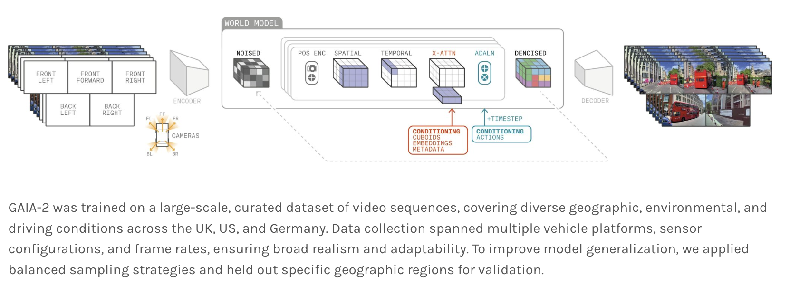

</img>

## Gaia2 - Pytorch (wip)

Implementation of the world model architecture for the domain of self driving out of Wayve

Please let me know your thoughts of the paper [here](https://discord.gg/na5MQBUJqb), positive or negative, so I can gauge its significance / prioritize

## Citations

```bibtex
@article{Russell2025GAIA2AC,
    title   = {GAIA-2: A Controllable Multi-View Generative World Model for Autonomous Driving},
    author  = {Lloyd Russell and Anthony Hu and Lorenzo Bertoni and George Fedoseev and Jamie Shotton and Elahe Arani and Gianluca Corrado},
    journal = {ArXiv},
    year    = {2025},
    volume  = {abs/2503.20523},
    url     = {https://api.semanticscholar.org/CorpusID:277321454}
}
```
